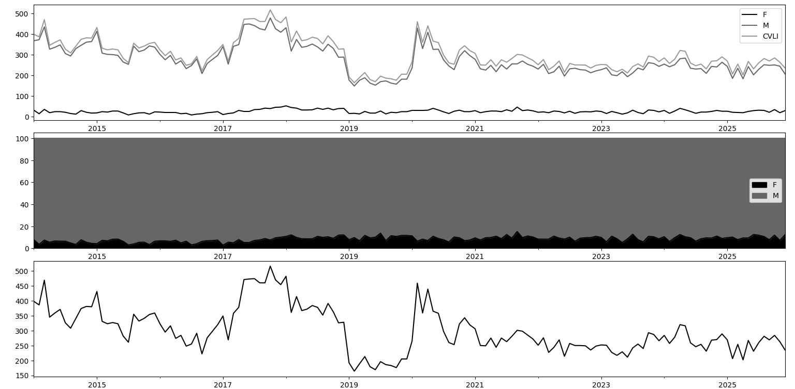
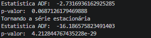
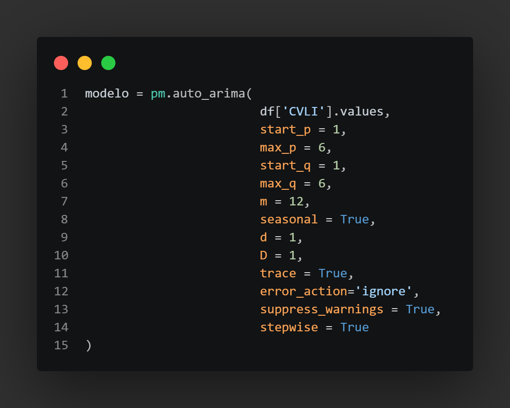
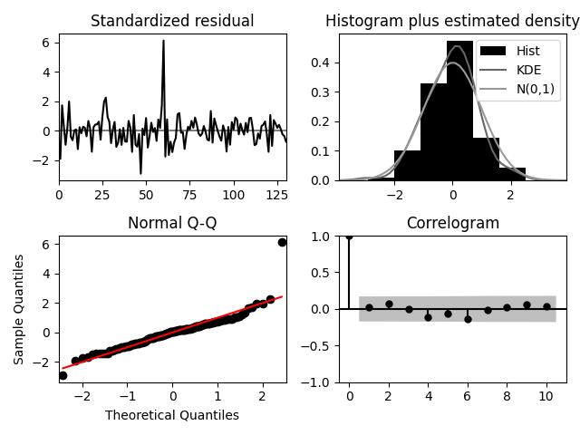
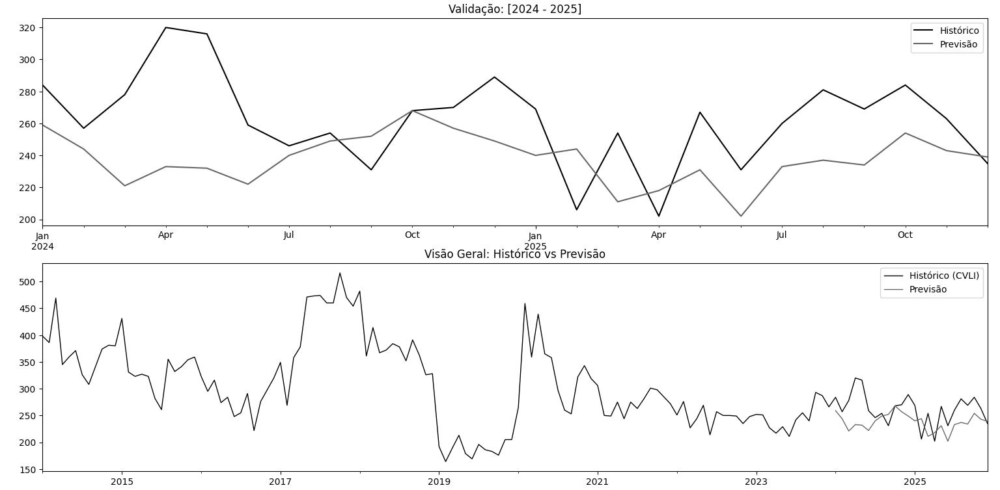
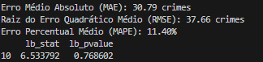

# Um Estudo Preditivo e Descritivo Sobre os CVLI Ocorridos no Estado do Ceará (2014 - 2025)

## 📄 Resumo
    
- **Problema**: As altas taxas de criminalidade são um dos problemas mais graves enfrentados pelo estado do Ceará nos últimos anos. Partindo desse pressuposto, como criar um estudo de análise preditiva e descritiva que evidencie o comportamento desses números nos últimos 12 anos no estado, com a finalidade de obter informações relevantes acerca dessa problemática?

- **Solução**: Realizar um estudo descritivo sobre os dados acumulados de CVLI (Crimes Violentos Letais e Intencionais) entre os anos de 2014 e 2025. Além disso, foram implementados algoritmos preditivos com o intuito de obter possíveis cenários para os valores acumulados de CVLI no ano de 2026 no Ceará.

 a parte do impacto deve ser alterada 

- **Impacto:** O estudo identificou tendência de queda nos números de assassinatos no estado para os próximos anos, mas com números preocupantes que merecem atenção do poder público. 

## 📋 Introdução e Contextualização

- **Objetivo:** O objetivo principal deste estudo é extrair insights estratégicos sobre os índices de CVLI no estado do Ceará. A análise identifica padrões, como os meses com maior incidência de crimes, visando fornecer subsídios fundamentais tanto para a Secretaria de Segurança Pública quanto para a sociedade civil."

- **Metodologia:** Na análise preditiva, as ferramentas utilizadas foram a linguagem de programação Python, empregada na análise exploratória e na construção dos modelos preditivos SARIMA e (). Para a análise descritiva, utilizou-se o Tableau para a criação e visualização do dashboard, o Python para extração e tratamento dos dados, e o Excel para a visualização da base de dados.  

## 🎲 Coleta de Dados

- **Fonte:** Os dados foram obtidos por meio do site da Secretaria de Segurança Pública do Estado do Ceará e organizados em uma planilha do Excel. Como as informações estavam completas, não foi necessário realizar o tratamento de campos nulos ou dados faltantes. Os dados estão distribuídos por mês de ocorrência e gênero da vítima (Feminino ou Masculino), totalizando 144 registros que representam cada mês dos 12 anos analisados no estudo (2014 a 2025).

## 📁 Estrutura do Projeto

| Arquivo | Descrição |
|---------|-----------|
|Dashboard | Análise Descritiva dos CVLI ocorridos no Ceará (2014 - 2025) |
|Dados | Base de Dados utilizada para o estudo |
| Img | Imagens dos plots dos modelos para análise|
| `Sarima.py` | Análise exploratória + .... |
| `.py` |  |

## 🔭  Análise Exploratório de Dados

### Distribuição dos Homicidios Ceará (2014 - 2025) 

A base de dados compreende 144 observações mensais (2014 a 2025). Os dados de CVLI são divididos pelas variáveis M (Masculino) e F (Feminino). Como evidenciado no Gráfico 3, a série histórica é composta, majoritariamente, por vítimas do sexo masculino; nota-se que o comportamento da curva de CVLI é quase integralmente ditado pela variação dos dados de homens, dada a baixa representatividade estatística das ocorrências femininas no montante total.

### Decomposição da Série Temporal 

*Interpretação dos Gráficos Obtidos*

**Distribuição**
  
- VARIAÇÃO: Os dados de CVLI iniciam com o patamar um pouco superior a 400 no ano de 2014, seguido de algumas oscilações. Posteriormente, observar-se uma redução drástica entre os meses finais de 2018 e iniciais de 2019. O ano  2017 apresentou o maior valor observado de CVLI além de ser o ano com maior valor acumulado de homicídios no estado do Ceará. Por outro lado, o ano de 2019 apresentou o menor valor  observado na série, com meses apresentando dados inferiores a 200 CVLIs.

- Volatilidade: Observa-se fortes oscilações, com picos muitos acentuados e reduções drásticas em alguns períodos da série. Essas flutuações podem ter sido influenciadas por eventos externos como crises na segurança pública, conflitos entre facções criminosas e entre outros eventos externos.  

**Trend (Tendência)**

- Queda: A série inicia com valor de 400 CVLI no ano de 2014, seguida de uma queda suave até atingir seu menor valor no mês 35 (Fim do ano de 2015). Posteriormente, houve um aumento expressivo atingindo o seu pico no mês 45 (ano de 2017) o ano mais violento observado em todo o intervalo. Nos anos seguintes houve queda acentuada nos números de CVLI até o mês 65 (Ano de 2019). 

- Estabilidade: Após o mês 80 (ano de 2020), a tendencia dos dados é queda suave e constante, sugerindo que políticas públicas de segurança ou condições externas (Fim de brigas entre facções por influência em território de tráfico de drogas) podem ter afetado os números de CVLI, onde os números de assassinatos estiveram sob relativo controle nos últimos anos da séries, sem novos picos explosivos observados. Por fim, nos últimos 4 anos de amostra observa-se uma certa estabilidade nos dados (Com uma pequena variabilidade dos dados).

**Seasonal (Sazonal):**

- Observa-se uma padrão sazonal claro nos homicídios do estado do Ceará ao longo dos anos. O primeiro período de aumento ocorre entre os meses de fevereiro e março, com expressivo aumento dos assassinatos, possivelmente influenciado por festividades como carnaval e o período de férias. O maior pico sazonal é observado entre os meses de Julho e Agosto, coincidindo com férias do meio do ano, período em que se registra as maiores altas nos crimes no estado. Em seguida, observa-se um período de estabilidade entre os meses de agosto e setembro, com poucas flutuações nos números. Por fim, após essa estabilidade há uma queda acentuada e contínua, que culmina em uma redução considerável atingindo seu ponto mais baixo no mês de dezembro

**Resid (Resíduo/Irregular/Restante):**

- Aleatoriedade: a maioria dos pontos concentra-se em torno de zero, sugerindo que o modelo de decomposição capturou bem os padrões (tendência e sazonalidade) da série. Os resíduos aparentam ser aleatórios, sem viés evidente.  

- Interpretação: Outliers (Pontos fora da curva) observa um outliers considerável no mês 72 (ano de 2020). Neste ano houve uma crise policial, onde delegacias foram fechadas e parte da força policial do estado não estava nas ruas, o que impactou de forma significativa esses valores. Eventos extraordinários como esse não são capturados pelos componentes de tendência e sazonalidade.

## 📚 Bibliotecas

Inseriri as bibliotecas usadas aqui.....

## 📈 Modelo SARIMA 

Antes de aplicar o modelo SARIMA, é necessário verificar a estacionariedade da série temporal. Por conta disso, foi aplicado o teste Augmented Dickey-Fuller (ADF). Na primeira aplicação, observa-se um p-valor de aproximadamente 0.068, indicando que a série original é não-estacionária, considerando o nível de significância de 5%.Para ajustar esse comportamento, aplicou-se a técnica de diferenciação para remover a tendência. Após a implementação desse processo, o novo p-valor observado foi de $4.2128 \times 10^{-29}$. Como esse valor é significativamente inferior a 0.05, a série torna-se estacionária, estando apta para a modelagem.

### Modelo Escolhido 

Código utilizado para encontra os melhores parâmteros para o modelo, considerendo uma sazonalidade mensal m = 12. 

Modelo escolhido: 

    ARIMA(1, 1, 0)(2, 1, 0)[12]

### Diagnosticos do Modelo SARIMA 

- **Standardized residual (Resíduo padronizado)**: Na maior parte do tempo, temos que os dados estão bem distribuidos. POr outro lado, temos que há um ponto fora da curva (outlier) no indice 60, onde o erro salta de forma significativa para cima de 6. Por fim, isso evidencia um evento isolado que o modelo não conseguiu prever. 

- **Histogram(Histograma)**: Os residuos são aproximadamente normais, embora o evento isolado observado pode ter impactado na distribuição. 

- **Theoretical Quantiles (Gráfico Quantil-Quantil)**: Há presença de "caudas pesadas", o que pode signifcar que o modelo tem dificukdade com valores extremos como ponto isolado mostrado no gráfico 1. 

- **Correlogram (ACF - Função de Autocorrelação)**:  Pelo o gráfico não há correlação serial residual. Ou seja, o modelo conseguiu "remover" toda a dependência temporal dos dados. 

Um atenção para o modelo é o ponto 60 observado no gráfico 1 (possivelmente ano de 2019 - ano de motim da policia militar no estado do Ceará). Fora isso, o modelo está bem ajustado. 

### Validação do Modelo (Previsões 2024 - 2025)

### Metricas do SARIMA (MAE | MAPE | RMSE)

- **MAE (Mean Absolute Error)**: O MAE observado foi de 30.79. Isso indica que o modelo erra, em média, 31 ocorrências de CVLI por período.

- **RMSE (Root Mean Square Error)**: O valor do RMSE (37.66) apresentou-se próximo ao MAE. Essa baixa diferença entre as duas métricas sugere que o modelo é consistente e não está cometendo erros de grande magnitude.

- **MAPE**: Com um MAPE de 11.40%, o modelo demonstra uma boa performance preditiva. Isso indica previsões sólidas e confiáveis para séries temporais de fenômenos sociais . 

### Validação Estatística do Modelo (Ljung-Box)

- **lb_pvalue e lb_stat**: como o valor de p-valor (0.768602) é inferior a 0.05, então  a hipotése nula deve ser considerada. Além disso, com os valores observados pelo p-valor (0.768602) e lb_stat (6.533792) desmostram que modelo captrou adequadamente os padrões sazonais e de tendência da série (os ruídos se comportam como ruído branco). 

## 📊 Resultados

| Modelo                |  MAPE  |  MAE  | RMSE| LB_STAT(Lag 10) | LB_pVALUE     |
|-----------------------|--------|-------|-----|-----------------|---------------|
|  |   | |  |   | |
| Sarima                | 11.40% | 30.79| 37.66 |  6.533792 |0.768602|

✅ .

## ▶️ Como reproduzir
