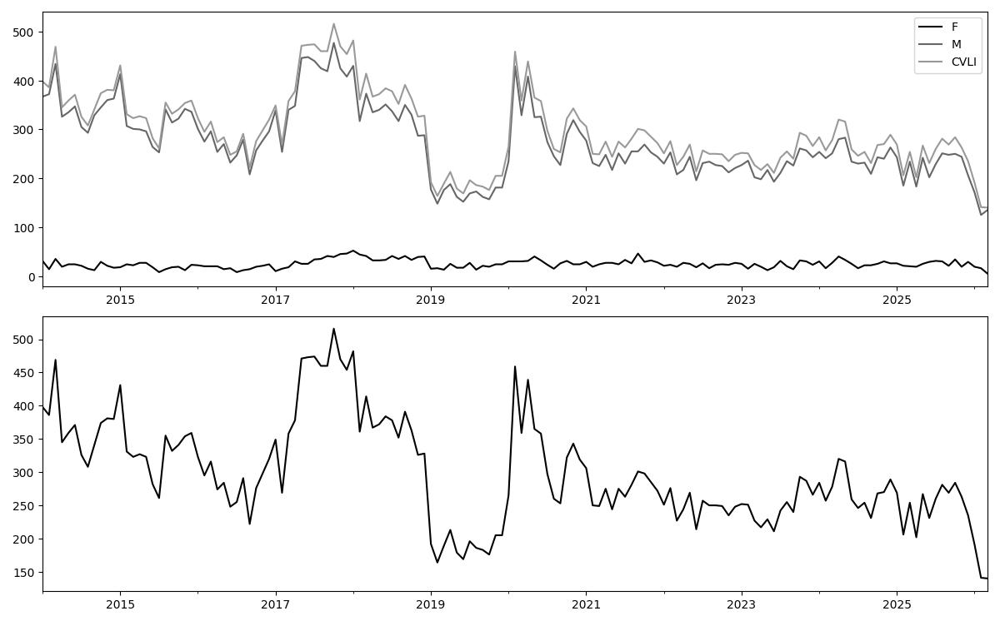
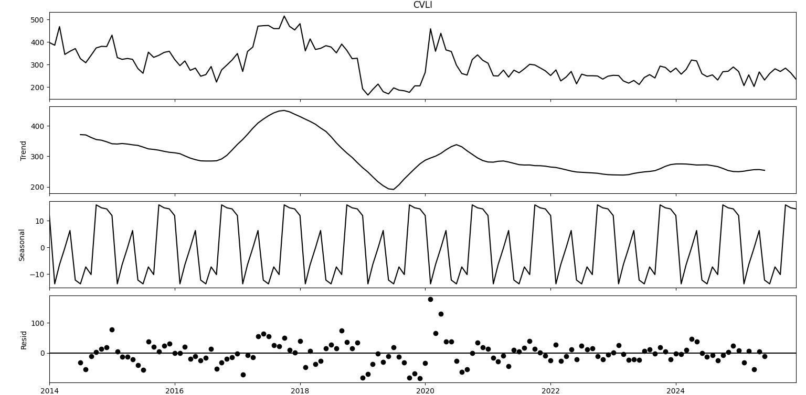
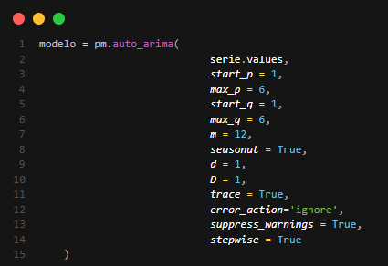
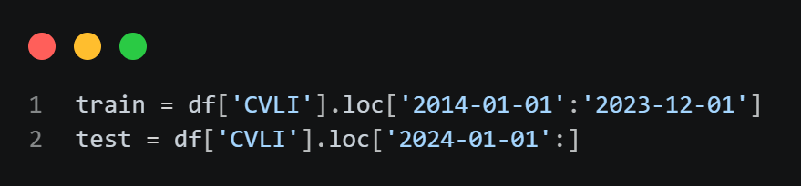
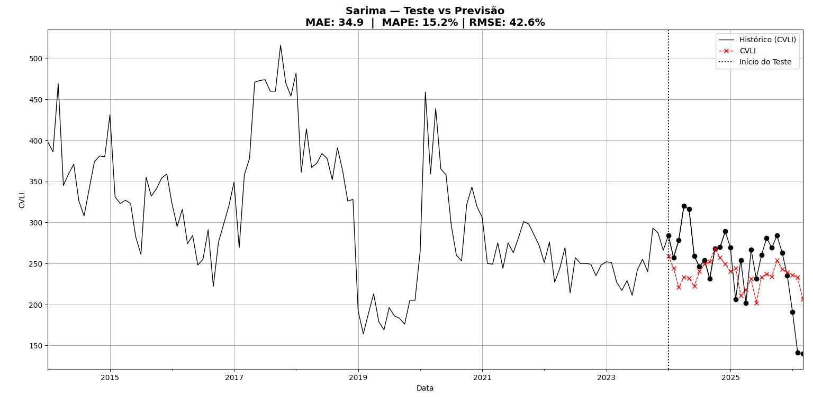
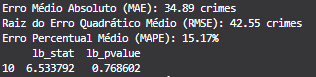
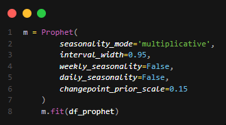
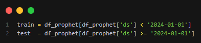
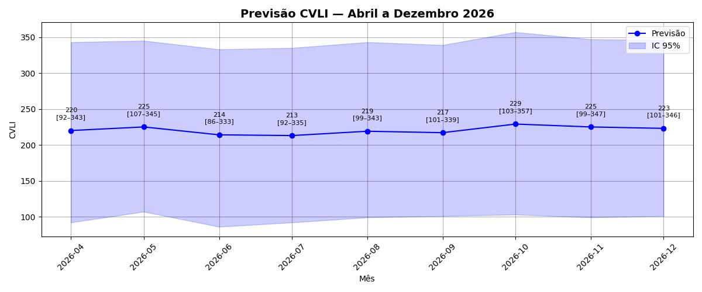
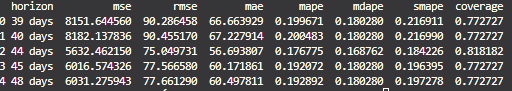

# Um Estudo Preditivo e Descritivo Sobre os CVLI Ocorridos no Estado do Ceará (2014 - 2025)

## 📄 Resumo
    
- **Problema**: As altas taxas de criminalidade são um dos problemas mais graves enfrentados pelo estado do Ceará nos últimos anos. Partindo desse ponto, como criar um estudo que evidencie o comportamento dos número de homicídios no estado do Ceará, com a finalidade de obter informações relevantes acerca dessa problemática?

- **Solução**: Realizar um estudo descritivo sobre os dados acumulados de CVLI (Crimes Violentos Letais e Intencionais) entre os anos de 2014 e 2025, e implementar algoritmos preditivos com o intuito de obter possíveis cenários para os valores acumulados de CVLI no ano de 2026 no Ceará.

- **Impacto:** No ano de 2025 o estado do Ceará apresentou um total de 3.178 homicidios. Partindo disso, temos que o estudo identificou tendência de queda nos número de CVLI observados no estado do ceará para o ano de 2026. Entretando, apesar da tendência de redução, os dados ainda são preocupantes, o que mostra a necessidade de politicas públicas direcionadas para o combate do crime organizado e redução de taxa de homicídios em todas as esferas do estado. 


| Modelo                |  Consolidados (Jan - Mar)   | Melhor (Cenário) | Previsto (Abr - Dez)| Pior (Cenário)|Total (2026) Previsto |
|-----------------------|--------|-------|-------|-------|-----|
| Exponential Smoothing | 472 |- | 1255|- | 1727|  
| Sarima                 |472 |- |1342| -| 1814 |  
| Prophet               |472| 1326 |1982 |3593 |2454|

```
 Total (2026) Previsto = Consolidados + Previsto
```


A divergência entre os modelos projetados e os dados históricos de 2025 sugere a influência de fatores sazonais e externos. Destaca-se que o ano de 2026 (o Ceará apresentou uma redução considerável no número de CVLI no priemiro trimestre). Além disso, sendo ano de pleito eleitoral para o Executivo Estadual, onde são intensificadas políticas de policiamento ostensivo, o que pode explicar a redução atípica observada no primeiro trimestre e a subsequente projeção de queda acentuada pelos modelos de suavização e séries temporais. 


## 📋 Introdução e Contextualização

- **Objetivo:** O objetivo principal deste estudo é extrair insights estratégicos sobre os índices de CVLI no estado do Ceará. A análise identifica padrões, como os meses com maior incidência de crimes, visando fornecer infromações fundamentais sobre o número de homicídios no Ceará.

- **Metodologia:** Na análise preditiva, as ferramentas utilizadas foram a linguagem de programação Python, empregada na análise exploratória e na construção dos modelos preditivos foram impleemntadas três métodos de modelagem de séries temporais: Sarima, Exponential Smoothing e Prophet. Para a análise descritiva, utilizou-se o Tableau para a criação e visualização do dashboard e o Python para extração e tratamento dos dados.  

## 🎲 Coleta de Dados

- **Fonte:** Os dados foram obtidos por meio do portal da Secretaria de Segurança Pública e Defesa Social (SSPDS) do Estado do Ceará e organizados em um arquivo no formato .csv. Devido à integridade das informações, não foi necessária a aplicação de técnicas para tratamento de valores nulos ou dados faltantes. O conjunto de dados compreende 144 registros mensais, cobrindo o intervalo de 12 anos (2014 a 2025), com a distribuição das ocorrências por gênero (Feminino e Masculino). Para a elaboração das previsões, foram utilizadas as colunas de séries históricas e a variável correspondente ao somatório total de CVLI ocorridas no respectivo mes.

## 📁 Estrutura do Projeto

```

analise_cvli_ceara/
├── dados/                                       # 🎲 Dados utilizados no estudo
│    ├── cvli_processados.csv                    
│    └── cvli_acumulados_ano.csv                 
├── dashboard/                                  #style Dashboard 
│    └── style/
│       └── style.css                         
│                               
├── models/                                      # 🔬 Moddelo previsão gerados no estudo
│    ├── previsao_exponential_smoothing.joblib  
│    ├── previsao_prophet.joblib  
│    └── previsao_sarima.joblib                  
├── img/                                         # 📁 Diretórios com as imagens usadas no README
│    ├── exponential smoothing/                 
│    ├── sarima/    
│    ├── prophet/                       
│    └── serie/
├── src/
│    ├── exponential_smoothing/
│    │   ├── exponential_smoothing.py            # 🔭 Modelo Preditivo Implementado 
│    │   ├── modelo.py                           # ▶️ Funções de construção do modelo  
│    │   └── plots.py                            # 🔎 Visualização dos Gráficos
│    │
│    ├── sarima/                             
│    │   ├── sarima.py                           # 🔭 Modelo Preditivo Implementado 
│    │   ├── modelo.py                           # ▶️ Funções de construção do modelo  
│    │   └── plots.py                            # 🔎 Visualização dos Gráficos
│    │    
│    └── prophet/                             
│        ├── prophet_cvli.py                    # 🔭 Modelo Preditivo Implementado 
│        ├── modelo.py                           # ▶️ Funções de construção do modelo  
│        └── plots.py                            # 🔎 Visualização dos Gráficos
├── outputs/                                     # 🎲 Previsões geradas pelos modelos 
│     ├── previsao_exponential_smoothing.csv
│     ├── previsao_prophet.csv
│     └── previsao_sarima.csv                                   
├── requirements.txt                             # 💻 Bibliotecas usadas no projeto 
├── .gitignore
├── index.html                                   # 📊 Análise Descritiva (2014 - 2025)
├── main.py                                      # 🎯 Função principal 
└── README.md                                    # 📋 Relatório final do Projeto 

```


## 🔭  Análise Exploratório de Dados

### Distribuição dos Homicidios Ceará (2014 - 2025) 

<div align="center">
  
</div>

A base de dados compreende 144 observações mensais (2014 a 2025). Os dados de CVLI estão distribuídas pelo Mes de ocorrência, pela variável CVLI que represnta a soma total de CVLI observado e pelas variáveis M (Masculino) e F (Feminino). A série histórica é composta, majoritariamente, por vítimas do sexo masculino; nota-se que o comportamento da curva de CVLI é quase integralmente ditado pela variação dos CVLI ocorrodos com vítimas do sexo masculino, dada a baixa representatividade estatística das ocorrências crimes contra pessoas do sexo feminino.


### Decomposição da Série Temporal 

<div align="center">
  
</div>

*Interpretação dos Gráficos Obtidos*

**Distribuição**
  
- VARIAÇÃO: Os dados de CVLI iniciam com o patamar um pouco superior a 400 no ano de 2014, seguido de algumas oscilações. Posteriormente, observar-se uma redução drástica entre os meses finais de 2018 e iniciais de 2019. O ano  2017 apresentou o maior valor observado de CVLI além de ser o ano com maior valor acumulado de homicídios no estado do Ceará. Por outro lado, o ano de 2019 apresentou o menor valor  observado na série, com meses apresentando dados inferiores a 200 CVLIs.

- Volatilidade: Observa-se fortes oscilações, com picos muitos acentuados e reduções drásticas em alguns períodos da série. Essas flutuações podem ter sido influenciadas por eventos externos como crises na segurança pública e conflitos entre facções.  

**Trend (Tendência)**

- Queda: A série inicia com valor de 400 CVLI no ano de 2014, seguida de uma queda suave até atingir seu menor valor no mês 35 (Fim do ano de 2015). Posteriormente, houve um aumento expressivo atingindo o seu pico no mês 45 (ano de 2017) o ano mais violento observado em todo o intervalo. Nos anos seguintes houve queda acentuada nos números de CVLI até o mês 65 (Ano de 2019). 

- Estabilidade: Após o mês 80 (ano de 2020), a tendencia dos dados é queda suave e constante, sugerindo que políticas públicas de segurança ou condições externas (Fim de brigas entre facções por influência em território de tráfico de drogas) podem ter afetado os números de CVLI, onde os números de assassinatos estiveram sob relativo controle nos últimos anos da séries, sem novos picos explosivos observados. Por fim, nos últimos 4 anos de amostra observa-se uma certa estabilidade nos dados (Com uma pequena variabilidade dos dados).

**Seasonal (Sazonal):**

- Observa-se uma padrão sazonal claro nos homicídios do estado do Ceará ao longo dos anos. O primeiro período de aumento ocorre entre os meses de fevereiro e março, com expressivo aumento dos assassinatos, possivelmente influenciado por festividades como carnaval e o período de férias. O maior pico sazonal é observado entre os meses de Julho e Agosto, coincidindo com férias do meio do ano, período em que se registra as maiores altas nos crimes no estado. Em seguida, observa-se um período de estabilidade entre os meses de agosto e setembro, com poucas flutuações nos números. Por fim, após essa estabilidade há uma queda acentuada e contínua, que culmina em uma redução considerável atingindo seu ponto mais baixo no mês de dezembro

**Resid (Resíduo/Irregular/Restante):**

- Aleatoriedade: a maioria dos pontos concentra-se em torno de zero, sugerindo que o modelo de decomposição capturou bem os padrões (tendência e sazonalidade) da série. Os resíduos aparentam ser aleatórios, sem viés evidente.  

- Interpretação: Outliers (Pontos fora da curva) observa um outliers considerável no mês 72 (ano de 2020). Neste ano houve uma crise policial, onde delegacias foram fechadas e parte da força policial do estado não estava nas ruas, o que impactou de forma significativa esses valores. Eventos extraordinários como esse não são capturados pelos componentes de tendência e sazonalidade.

## 📚 Bibliotecas

- statsmodels (v0.14.6)
- scikit-learn (v1.8.0)
- matplotlib (v3.7.1)
- pandas (v3.0.2)
- pmdarima (v2.1.1)
- numpy (v1.26.4)
- joblib (v1.5.3)
- Ambinete de Desenvolvimento (Visual Studio Code)
- Python Linguagem de Programação 

## 📈 Modelo SARIMA 

Antes de aplicar o modelo SARIMA, é necessário verificar a estacionariedade da série temporal. Por conta disso, foi aplicado o teste Augmented Dickey-Fuller (ADF). Na primeira aplicação, observa-se um p-valor de aproximadamente 0.068, indicando que a série original é não-estacionária, com um nível de significância de 5%. Para ajustar esse comportamento, aplicou-se a técnica de diferenciação para remover a tendência. Após a implementação desse processo, o novo p-valor observado foi de $4.2128 \times 10^{-29}$. Como esse valor é significativamente inferior a 0.05, a série torna-se estacionária, estando apta para a modelagem.


<div align="center">
  
</div>

### Auto-Arima 

Algoritmo implementado para testar diferentes combinações de parâmetros para selecionar o melhor ajuste com base nos critérios estatísticos.


<div align="center">
  
</div>

Modelo escolhido: 

    ARIMA(1, 1, 0)(2, 1, 0)[12]

### Diagnosticos do Modelo SARIMA 

<div align="center">
  
</div>

- **Standardized residual (Resíduo padronizado)**: Na maior parte do tempo, temos que os dados estão bem distribuidos. POr outro lado, temos que há um ponto fora da curva (outlier) no indice 60, onde o erro salta de forma significativa para cima de 6. Por fim, isso evidencia um evento isolado que o modelo não conseguiu prever. 

- **Histogram(Histograma)**: Os residuos são aproximadamente normais, embora o evento isolado observado pode ter impactado na distribuição. 

- **Theoretical Quantiles (Gráfico Quantil-Quantil)**: Há presença de "caudas pesadas", o que pode signifcar que o modelo tem dificukdade com valores extremos como ponto isolado mostrado no gráfico 1. 

- **Correlogram (ACF - Função de Autocorrelação)**:  Pelo o gráfico não há correlação serial residual. Ou seja, o modelo conseguiu "remover" toda a dependência temporal dos dados. 

Um atenção para o modelo é o ponto 60 observado no gráfico 1 (possivelmente ano de 2019 - ano de motim da policia militar no estado do Ceará). Fora isso, o modelo está bem ajustado. 

### Treinamento 

Foi realzado uma divisão da base de dados para treinamento e teste como evidência a imagem abaixo. 

<div align="center">
  
</div>

### Validação do Modelo (Previsões 2024 - 2025)


<div align="center">
  
</div>

### Metricas do SARIMA (MAE | MAPE | RMSE)


<div align="center">
  
</div>

As metricas apresentadas quando a base de dados estava levando em consideração os dados de (2014 - 2025)

<div align="center">
  
</div>

Valores obtidos ao inserir os dados dos meses de jan - mar de 2026. 
Nesse primeiro trimestre o estado do Ceará apresentou o menor número para primeiro trimestre da série histórico o que impactou o resultado final obtido pelo modelo. 

### Interpretação das Metricas do Modelo 

- **MAE (Mean Absolute Error)**: O MAE observado foi de 34.9. Isso indica que o modelo erra, em média, 35 ocorrências de CVLI por período. Dado a volatilidade dos dados é um desenepnho considerável dado a variabilidade do modelo. 

- **RMSE (Root Mean Square Error)**: O valor do RMSE (42.6) apresentou um valor reletivamente alto comparado ao MAE. Essa diferença entre as duas métricas sugere que o modelo teve um maior dificuldade, o que pode ser visto pela a inserção de novos dados do ano de 2026 que impactaram nas metricas finais do modelo.

- **MAPE**: Com um MAPE de 15.2%, o modelo demonstra uma boa performance preditiva. Isso indica previsões sólidas e confiáveis para séries temporais de fenômenos sociais . 

### Validação Estatística do Modelo (Ljung-Box)

- **lb_pvalue e lb_stat**: como o valor de p-valor (0.768602) é inferior a 0.05, então  a hipotése nula deve ser considerada. Além disso, com os valores observados pelo p-valor (0.768602) e lb_stat (6.533792) desmostram que modelo captrou adequadamente os padrões sazonais e de tendência da série (os ruídos se comportam como ruído branco). 

## 📈 Exponential Smoothing

### Modelo Exponential Smoothing  

<div align="center">
  
</div>

### Diagnosticos do Modelo  Exponential Smoothing  


### Treinamento 

<div align="center">
  
</div>

### Validação do Modelo (Previsões 2024 - 2025)

<div align="center">
  
</div>


### Metricas do  Exponential Smoothing   (MAE | MAPE | RMSE)


Valores obtidos ao inserir os dados dos meses de jan - mar de 2026. 
Nesse primeiro trimestre o estado do Ceará apresentou o menor número para primeiro trimestre da série histórico o que impactou o resultado final obtido pelo modelo. 


- **MAE (Mean Absolute Error)**: O MAE observado foi de 30.79. Isso indica que o modelo erra, em média, 31 ocorrências de CVLI por período.

- **RMSE (Root Mean Square Error)**: O valor do RMSE (37.66) apresentou-se próximo ao MAE. Essa baixa diferença entre as duas métricas sugere que o modelo é consistente e não está cometendo erros de grande magnitude.

- **MAPE**: Com um MAPE de 11.40%, o modelo demonstra uma boa performance preditiva. Isso indica previsões sólidas e confiáveis para séries temporais de fenômenos sociais . 

### Validação Estatística do Modelo 


## 📈 Prophet


### IMplmentação do Modelo 

Modelo implementado no prophet 
<div align="center">
  
</div>

### Treinamento 

Divisão treino e teste para validação do modelo implmentado 

<div align="center">
  
</div>

### Previsão com intervalo de Confiança 

Previsão do Modelo Prophet com intervalo de confiança de 95% 
<div align="center">
  
</div>

### Validação Cross-Validation 

Validção cruzada (Cross validation)

<div align="center">
  
</div>


## 📊 Resultados

| Modelo                |  MAPE  |  MAE  | RMSE| LB_STAT(Lag 10) | LB_pVALUE  |
|-----------------------|--------|-------|-----|-----------------|------------|
| Sarima                | 15.17% | 34.89| 42.55 |  6.533792 |0.768602 |
| Exponential Smoothing | 13.64% | 30.48| 38.14 |  9.652282 |0.471511 | 
|prophet |19.23% |60.85|82.20|~|~|


✅  O melhor modelo para essa base de dados foi o Exponential Smmothing 


## ▶️ Como reproduzir


```

⏩ Executar a função Main()
      | 
      ├── executa exponential smoothing 1️⃣ 
      | 
      ├── executa sarima 2️⃣ 
      |
      ├── executa prophet 3️⃣ 
      | 
      └── executa dashborad /página html 4️⃣ 
    
```
